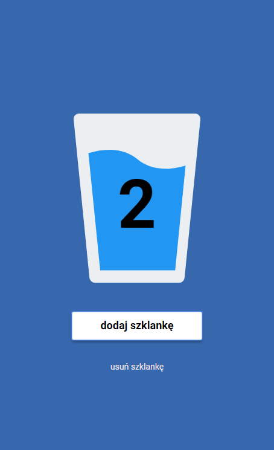

# Water APP

PWA web application for counting drunk glasses of water today. Application implemented in accordance with the graphic design.

## Technologies used
* HTML 5
* SCSS
* JavaScript
* Gulp
* NPM
* PWA

## How to run and deploy

`npm install -g gulp-cli`

`npm install`

`gulp`

To publish your page using github pages use `npm run deploy`